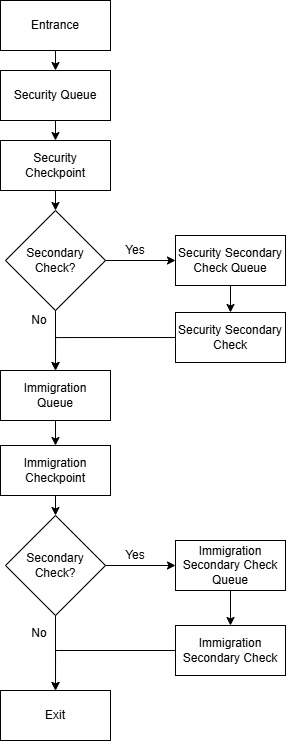

# Task 2 – System Design

## A) Process Flow

The simulation is a sequential, multi-stage queueing system with shared service pools and probabilistic inspection branching.

### Flow Summary & Key Rules
- Travellers progress sequentially through Security → Immigration → Exit  
- Each stage uses FCFS queues (shared or dedicated) that feed into shared service counters  
- Service counters operate as shared pools, assigning the next available traveller from queues  
- Secondary inspections are triggered probabilistically and depend on traveller attributes (risk, baggage, document readiness)  
- Secondary checks are handled in separate processing areas with longer service times  
- The system enforces a strictly forward-moving flow with no backtracking or stage re-entry  
- Completion of Security is mandatory before entering Immigration  

## B) System Components

### 1. Travellers (Agents)
- Individuals moving through the checkpoint system  
- Attributes: traveller type, risk level, baggage count, document readiness  
- Influence processing time and secondary inspection probability
- Traveller attributes are generated using scenario-based probability distributions to simulate different operational environments:
    - Default (baseline conditions)
    - Holiday (high passenger volume, slower movement)
    - High Risk (increased inspection likelihood and variability)

#### Traveller Attribute Distributions (Scenario Matrix)

| Attribute | Default Scenario | Holiday Scenario | High Risk Scenario |
|----------|------------------|------------------|--------------------|
| Move Speed | 5 – 20 | 5 – 8 | 10 – 16 |
| Baggage Count | 1 – 3 | 2 – 5 | 1 – 3 |
| Document Readiness | 0.7 – 1.0 | 0.5 – 1.0 | 0.0 – 1.0 |
| Traveller Type | 50% Leisure 40% Business 10% VIP | 70% Leisure 20% Business 10% VIP | 70% Leisure 20% Business 10% VIP |
| Risk Profile | 70% Low 20% Medium 10% High | 70% Low 20% Medium 10% High | 40% Low 35% Medium 25% High |

### 2. Queue System
The system uses two queueing models depending on stage type:

#### Ordered Queues (Security & Immigration)
- FCFS queues with slot-based capacity  
- Travellers may wait in a holding area if no slot is available  

#### Simple Queues (Secondary Check Areas)
- Unordered queues with flexible entry  
- Used for secondary inspection processing  

### 3. Service Counters
- Security counters (primary screening)  
- Immigration counters (primary clearance)  
- Secondary inspection counters (lower capacity, slower processing)
- Stations are generated using a configurable grid system (Rows × Columns)
- Each area (Security, Immigration, Secondary) supports dynamic station scaling at runtime

### 4. Scenario Manager
- Controls scenario presets and global simulation configuration including staffing, queue layout, processing rules, and secondary inspection modifiers

### 5. Metrics System
- Tracks wait times, queue lengths, throughput, utilisation, and bottlenecks  

### 6. Simulation Engine
- Manages time progression, traveller spawning, queue flow, service processing, and metric updates  

### 7. Runtime Configuration System
- Centralised parameter system controlling world generation and simulation behaviour
- Supports runtime modification of:
  - Station layouts
  - Processing time modifiers
  - Secondary inspection probabilities
  - Queue configurations

## C) Input Parameters

### 1. Simulation Control
- Random seed (controls reproducibility)  
- Simulation speed (time scaling factor)  
- Scenario presets (predefined system configurations)  

### 2. Demand Configuration
- Agent arrival rate (travellers per second)  

### 3. System Capacity
- Station configurations for each area (grid-based dynamic scaling)
- Active stations for each area (enable/disable counters)

### 4. Secondary Inspection Control
- Secondary check probability modifier (security)  
- Secondary check probability modifier (immigration)  

## D) Simulation Outputs

### 1. System Overview (Key Performance Indicators)
- Simulation time (runtime progress)  
- Active travellers (current system load)  
- Total travellers processed (throughput volume)  
- Overall throughput (travellers per minute)  
- Average total time in system (end-to-end performance)  
- Current bottleneck location (Security / Immigration / Secondary)  

### 2. Flow Throughput (System Capacity Analysis)
- Security throughput rate  
- Immigration throughput rate  
- End-to-end system throughput rate  

### 3. Queue Performance (Congestion Analysis)

**Security & Immigration Queues:**
- Current queue length  
- Average queue length  
- Peak queue length  
- Average waiting time  

### 4. Secondary Inspection Analytics

**Security Secondary / Immigration Secondary:**
- Secondary queue length  
- Average waiting time  
- Average processing time  
- Secondary check rate (%)  

### 5. Resource Utilisation
- Average utilisation (%)  
- Idle counters  
- Average processing time  

### 6. Bottleneck Analysis
Bottleneck is determined based on highest average waiting time:

- Security  
- Immigration  
- Security Secondary  
- Immigration Secondary  
- No significant bottleneck (if below threshold)  

## E) Assumptions

### 1. Process Assumptions
- All travellers must complete Security before Immigration  
- Processing stages are strictly sequential  
- No backtracking or re-entry to previous stages  

### 2. Queue Behaviour Assumptions
- Ordered queues operate on FCFS discipline with slot-based capacity  
- Travellers may wait in a holding area if no queue slot is available  
- Secondary inspection areas use unordered queueing structures  
- No queue jumping or overtaking occurs  

### 3. Service Assumptions
- Each counter processes one traveller at a time  
- Service times are stochastic and influenced by traveller attributes  
- Secondary inspections take longer and are more variable than primary processing  

### 4. Behavioural Assumptions
- Travellers do not abandon queues or exhibit impatience  
- Movement between stages is instantaneous after service completion  
- Traveller attributes remain constant throughout the simulation  

### 5. System Assumptions
- Counters are always available when idle (no breakdowns)  
- Secondary inspection probability is determined at entry to each stage  
- Random seed ensures reproducible simulation runs when enabled  

### 6. Scope Assumptions
- The model prioritises queueing and operational analysis over crowd realism  
- Agent movement is abstracted into system-level transitions  
- The simulation is intended for performance evaluation, not behavioural simulation  