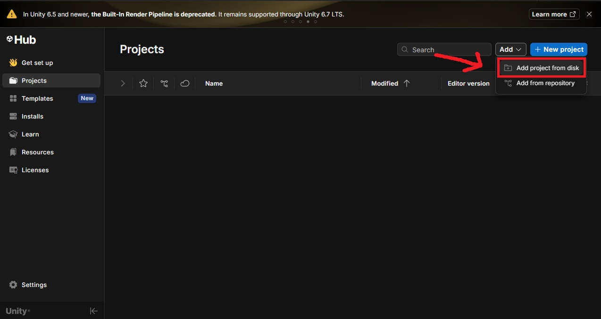
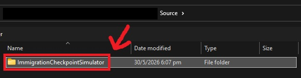
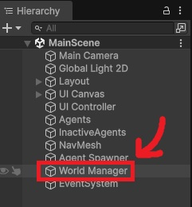
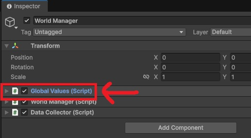
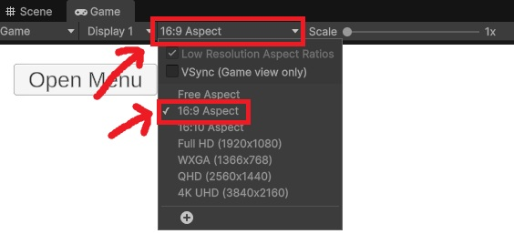

# Immigration Checkpoint Simulation

A Unity-based simulation system for modelling immigration checkpoint operations, focusing on queue dynamics, staffing efficiency, and bottleneck analysis under configurable scenarios.

## Overview

This project simulates a multi-stage checkpoint system where travellers pass through Security and Immigration, with optional probabilistic secondary inspections.

It is designed to analyse throughput, congestion, and operational performance under varying demand conditions.

## Documentation

All documentation is provided in both Markdown and Word formats. Both versions contain identical content.

## Engine Version

Unity 6000.4.8f1

## Setup Instructions

1. Open Unity Hub  
2. Open project folder:  
   "Source/ImmigrationCheckpointSimulator"
3. Allow Unity to import and compile the project  

## Run Instructions

1. Open scene:  
   Assets/Scenes/MainScene  

     
   

2. Before pressing Play, configure simulation settings in:  
   World Manager → Global Values (Inspector)

     
   

3. Press Play in the Unity Editor  

### Display Recommendation
For optimal UI layout, run the simulation in 16:9 aspect ratio. The interface is designed for widescreen display and may not scale correctly on other aspect ratios.

## Simulation Parameters

Simulation parameters are split into **creation-time setup** and **runtime control**.

### 1. Creation-Time Parameters (World Setup)

Defined before runtime via `World Manager → Global Values`.

- Station layouts
- Queue configurations
- Processing time modifiers
- Secondary inspection setup

**All variables in the `GlobalValues` script can be tuned to adjust simulation behaviour.**

### 2. Runtime-Adjustable Parameters

These can be modified before or during runtime to control simulation behaviour.

**Simulation Control**
- Random seed
- Simulation speed
- Scenario presets

**Demand Configuration**
- Agent arrival rate

**System Capacity**
- Active stations per area
- Station scaling configuration

**Secondary Inspection Control**
- Security secondary check probability
- Immigration secondary check probability

## Simulation Controls

### Camera
- WASD / Arrow Keys → Move camera
- Mouse Wheel → Zoom in/out

### UI
Top-left "Open Menu" button opens:
- Scenario Adjustment
- Custom Agent Spawner
- Metrics Dashboard